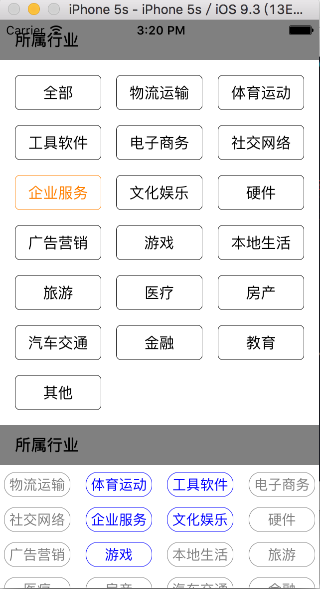

# Button-CollectionView
##    本人用UICollectionView封装成了Button,复用性很高,能够根据数据源的个数,生成多个按钮,也加入了点击事件.
### [点击这里可以链接到我的github](https://github.com/makingitbest/Button-CollectionView)
### [献上图,给你们看看效果,一个单选,一个多选]

